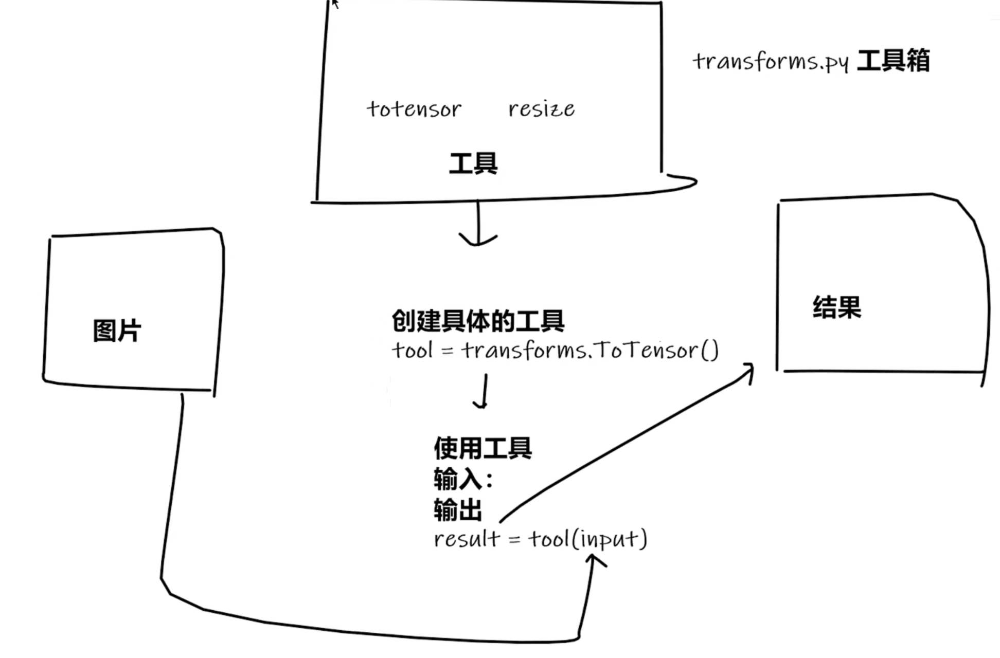
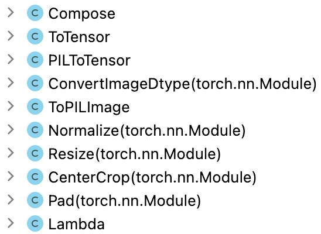

#### 0. 安装pytorch

https://pytorch.org/get-started/locally/

```
pip3 install torch torchvision torchaudio tensorboard opencv-python packaging six
```

学习视频：https://www.bilibili.com/video/BV1hE411t7RN/


#### 1. pytorch加载数据

Dataset: 提供一种方式获取**数据**和**标签**

- 抽象类，继承from **torch.utils.data** import Dataset 可以定义自己的数据集
- torchvision.datasets.xxx 提供常用的数据集

Dataloader: 按指定方式加载数据集

- from **torch.utils.data** import DataLoader


#### 2. tensorboard使用

##### 2.1. opencv

pip install opencv-python

import cv2

用来读取和显示图片，读取图片cv2.imread()返回值为numpy.array，shape 为 HWC， 在tensorboard中需要显示指定dataformat

##### 2.2 tensorboard可视化

可以添加和显示**图片**和**标量**数据

add_image 添加单张图片, add_images 添加多张图片

```
from torch.utils.tensorboard import SummaryWriter
import cv2

img_path = '/Users/linwang/Documents/source_code/py_test/mypytorch/dataset/train/bees/29494643_e3410f0d37.jpg'
writer = SummaryWriter('logs') # 在当前目录logs里面生成待展示文件

image = cv2.imread(img_path) # image type is tensor or numpy.array
writer.add_image('bees', image, 1, dataformats='HWC') # dataformats 显示指定图片格式为 height weight channel
for i in range(100):
    writer.add_scalar('y=x', i, i)
writer.close()
```

python3 -m tensorboard.main --logdir logs --port=6006 / tensorboard --logdir logs --port=6006

在 http://localhost:6006/#timeseries 中查看


#### 3. transforms的使用

transforms做为一个工具箱，里面提供的工具可以对**图片**进行各种转换

|  |
| ------------------------------------------------------------ |
|  |

##### 3.1 transforms怎样使用

```
from torchvision import transforms
from PIL import Image
image = Image.open(img_path) # 读取图片，PIL image, numpy.array 
tensor_trans = transforms.ToTensor() # 创建具体工具
tensor_img = tensor_trans(image) # 使用工具
```

##### 3.2 tensor数据类型 

tensor类型里面包含 backward, data, auto_grad等反向神经网络常用的方法

##### 3.3 常见的transforms

输入，输出，作用

**ToTensor**:*Convert a PIL Image or ndarray to tensor and scale the values accordingly*

**Normalize**: *Normalize a tensor image with mean and standard deviation.*

**Resize**: *Resize the input image to the given size*

**Compose**: *Composes several transforms together. This transform does not support torchscript*

##### 3.4 V1,V2版本 TODO 区别

Torchvision supports common computer vision transformations in the `torchvision.transforms` and `torchvision.transforms.v2` modules. Transforms can be used to transform or augment data for training or inference of different tasks (image classification, detection, segmentation, video classification).


#### 4. torchvison中数据集使用

https://pytorch.org/ 中Docs里面介绍常用的模块，PyTorch, torchaudio, torchtext, torchvision

案例，在tensorboard中显示cifar10的10张图片

```
import ssl
import torchvision
from torch.utils.tensorboard import SummaryWriter
from torchvision.transforms import v2
import torch

ssl._create_default_https_context = ssl._create_unverified_context # 避免下载错误

# download CIFAR10
train_set = torchvision.datasets.CIFAR10(root='cifar10', train=True, download=True)
test_set = torchvision.datasets.CIFAR10(root='cifar10', train=False, download=True)

image_2_tensor = v2.Compose([v2.ToImage(), v2.ToDtype(torch.float32, scale=True)]) #ToTensor
writer = SummaryWriter('logs')
for index in range(10):
    image, _ = test_set[index]
    tensor_img = image_2_tensor(image)
    writer.add_image('CIFAR10', image_2_tensor(image), global_step=index)
writer.close()
```


#### 5. DataLoader使用

|  |
| ------------------------------------------------------------ |

torch.utils.data.DataLoader https://pytorch.org/docs/stable/data.html#torch.utils.data.DataLoader

DataLoader(dataset=test_data, batch_size=64, shuffle=True, num_workers=0, drop_last=False)

输出： images, labels


#### 6. nn.Module使用
1. 怎样计算卷积：矩阵对应位置相乘最后相加
2. **torch.reshape**(*input*, *shape*) 可以修改input tensor的形态


