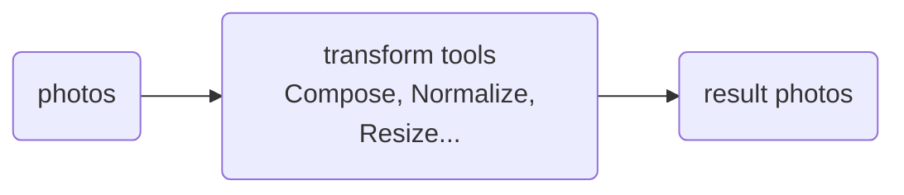
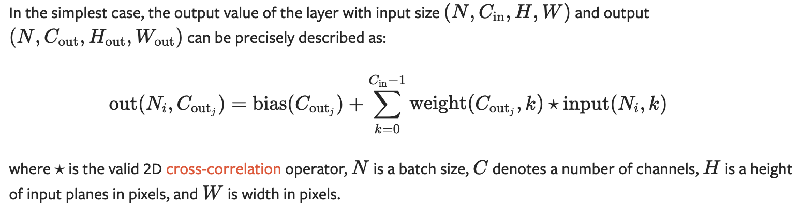
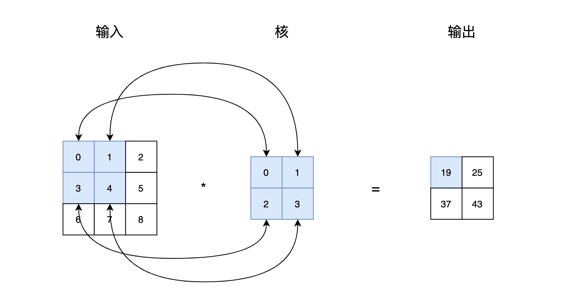
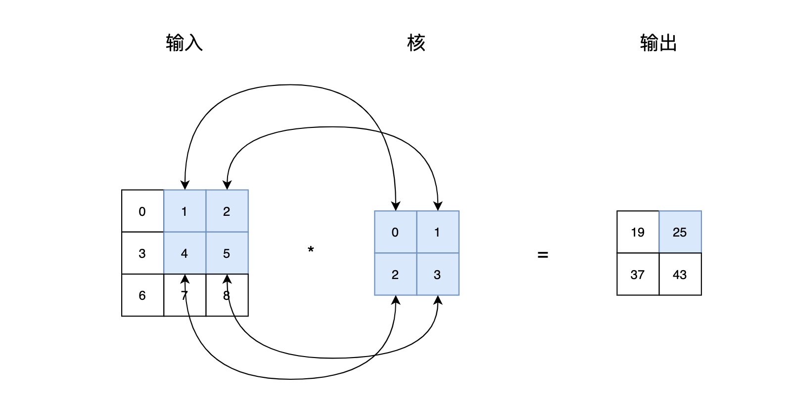
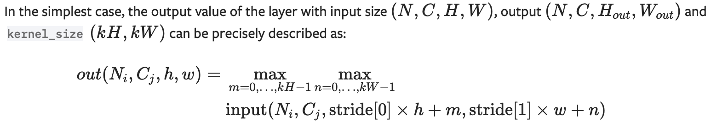
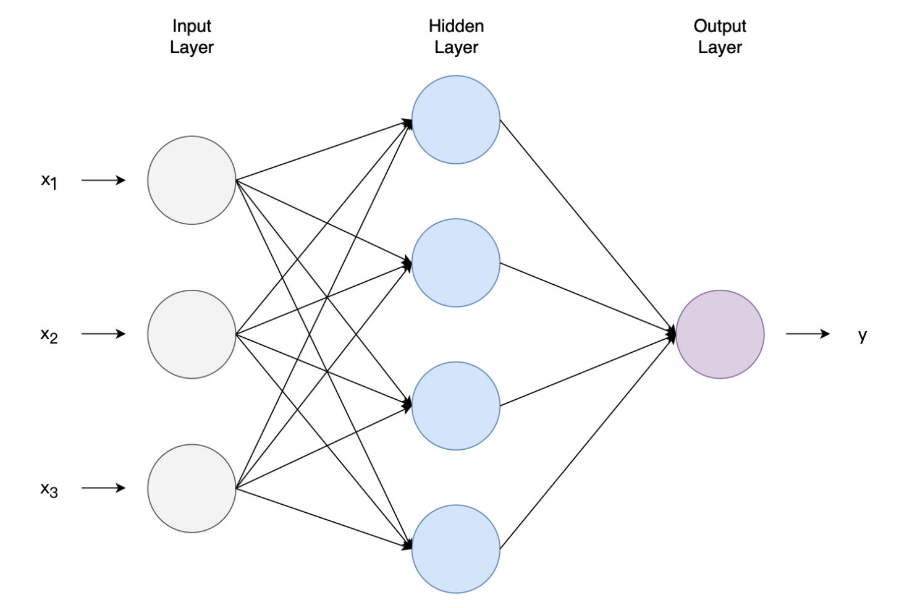
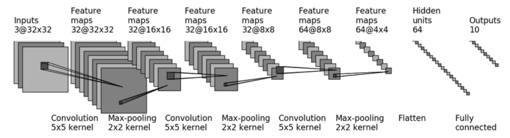

[TOC]

# 0. 安装pytorch

https://pytorch.org/get-started/locally/

```
pip3 install torch torchvision torchaudio tensorboard opencv-python packaging six
```

学习视频：https://www.bilibili.com/video/BV1hE411t7RN/


# 1. 加载数据

Dataset: 提供一种方式获取**数据**和**标签**

- 抽象类，继承from **torch.utils.data** import Dataset 可以定义自己的数据集
- torchvision.datasets.xxx 提供常用的图像数据集，CIFAR10, ImageNet, CoCo, etc.
- ```
	image_2_tensor = v2.Compose([v2.ToImage(), v2.ToDtype(torch.float32, scale=True)])
	dataset = torchvision.datasets.CIFAR10(root='cifar10', train=False, transform=image_2_tensor, download=True)
	```

Dataloader: 按指定方式加载数据集

- from **torch.utils.data** import DataLoader

- ```
	data_loader = DataLoader(dataset=dataset, batch_size=64)
	image, target = next(iter(data_loader))
	```

	

# 2. torchvision.transforms

## 2.1 读取图片

- opencv

```
	pip install opencv-python
	import cv2
	img = cv2.imread(str(img_item_path)) # numpy.array, shape 为 HWC
```

- PIL,  Python Image Library

```
	from PIL import Image
	image = Image.open(img_path) # PIL.Image.Image
```

## 2.2 transforms介绍

transforms做为一个工具箱，里面提供的工具可以对**图片**进行各种转换

Torchvision supports common computer vision transformations in the `torchvision.transforms` and `torchvision.transforms.v2` modules. 



**ToTensor**:*Convert a PIL Image or ndarray to tensor and scale the values accordingly*

**Normalize**: *Normalize a tensor image with mean and standard deviation.*

**Resize**: *Resize the input image to the given size*

**Compose**: *Composes several transforms together. This transform does not support torchscript*

## 2.3 transforms使用

```
from torchvision import transforms
from PIL import Image
image = Image.open(img_path) # 读取图片，PIL image, numpy.array 
tensor_trans = transforms.ToTensor() # 创建具体工具
tensor_img = tensor_trans(image) # 使用工具
```

## 2.4 tensor数据类型 

tensor类型里面包含 backward, data, auto_grad等神经网络常用的方法

A [`torch.Tensor`](https://pytorch.org/docs/stable/tensors.html#torch.Tensor) is a multi-dimensional matrix containing elements of a single data type.

```
torch.tensor([[1, 2, 3], [4, 5, 6]])
torch.zeros([2, 4], dtype=torch.int32)
torch.ones([2, 4], dtype=torch.float64, device='mps')
torch.reshape(input, shape) #可以修改input tensor的形态
torch.flatten(input, start_dim=0, end_dim=-1) #类似reshape，将多维数据展开
```

## 2.5 V1, V2版本 

TODO 区别


# 3. torch.utils.tensorboard

## 3.1 tensorboard介绍

可视化web服务，可以添加和显示**图片**，**标量**，**模型**等数据

|  |
| ------------------------------------------------------------ |

## 3.2 tensorboard使用

```
from torch.utils.tensorboard import SummaryWriter
import cv2

img_path = './29494643_e3410f0d37.jpg'
writer = SummaryWriter('logs') # 在当前目录logs里面生成待展示文件

image = cv2.imread(img_path) # image type is tensor or numpy.array
writer.add_image('bees', image, 1, dataformats='HWC') # dataformats 显示指定图片格式为 height weight channel
for i in range(100):
    writer.add_scalar('y=x', i, i)
writer.close()

# tensordboard 通过 writer.add_graph() 可以可视化网络模型，对学习很有帮助
```

tensorboard启动命令

```
tensorboard --logdir logs --port=6006
python3 -m tensorboard.main --logdir logs --port=6006 # 备选
http://localhost:6006 # 查看URL
```

*add_image 添加单张图片, add_images 添加多张图片*

## 3.3 综合练习

TODO ，dadaset, dataloader完整版

```
import ssl
import torchvision
from torch.utils.tensorboard import SummaryWriter
from torchvision.transforms import v2
import torch

ssl._create_default_https_context = ssl._create_unverified_context # 避免下载错误

# download CIFAR10
train_set = torchvision.datasets.CIFAR10(root='cifar10', train=True, download=True)
test_set = torchvision.datasets.CIFAR10(root='cifar10', train=False, download=True)

image_2_tensor = v2.Compose([v2.ToImage(), v2.ToDtype(torch.float32, scale=True)]) #ToTensor
writer = SummaryWriter('logs')
for index in range(10):
    image, _ = test_set[index]
    tensor_img = image_2_tensor(image)
    writer.add_image('CIFAR10', image_2_tensor(image), global_step=index)
writer.close()
```


# 4. 神经网络

## 4.1 模型(torch.nn.Module)

自定义模型的**基类**, 自定义模型需要继承nn.Module并实现init, forward方法

Base class for all neural network modules. Your models should also subclass this class.

```
import torch.nn as nn
import torch.nn.functional as F

class Model(nn.Module):
    def __init__(self): # 实现init方法
        super().__init__()
        self.conv1 = nn.Conv2d(1, 20, 5)
        self.conv2 = nn.Conv2d(20, 20, 5)

    def forward(self, x): # 实现forward方法
        x = F.relu(self.conv1(x))
        return F.relu(self.conv2(x))
```

## 4.2 卷积(torch.nn.Conv2d)

卷积是一种特殊的线性操作。卷积网络是简单的神经网络，它使用卷积代替至少一层中的一般矩阵乘法。

|  |
| ------------------------------------------------------------ |

示例，[1](https://github.com/vdumoulin/conv_arithmetic/blob/master/README.md), [2](https://lulaoshi.info/deep-learning/convolutional/two-dimension-convolution-layer.html)

*N.B.: Blue maps are inputs, and cyan maps are outputs.*

|  |
| :----------------------------------------------------------- |
| No padding, no strides                                       |

|  |  |
| ------------------------------------------------------------ | ------------------------------------------------------------ |
| 0 * 0 + 1* 1 + 3 * 2 + 4 * 3 = 19                            | 1 * 0 + 2 * 1 + 4 * 2 + 5 * 3 = 25                           |

```
conv = nn.Conv2d(in_channels=3, out_channels=3, kernel_size=5, padding=2, device=device)
conv(image_tensor)
```

- **in_channels** ([*int*](https://docs.python.org/3/library/functions.html#int)) – Number of channels in the input image
- **out_channels** ([*int*](https://docs.python.org/3/library/functions.html#int)) – Number of channels produced by the convolution
- **kernel_size** ([*int*](https://docs.python.org/3/library/functions.html#int) *or* [*tuple*](https://docs.python.org/3/library/stdtypes.html#tuple)) – Size of the convolving kernel
- **stride** ([*int*](https://docs.python.org/3/library/functions.html#int) *or* [*tuple*](https://docs.python.org/3/library/stdtypes.html#tuple)*,* *optional*) – Stride of the convolution. Default: 1
- **padding** ([*int*](https://docs.python.org/3/library/functions.html#int)*,* [*tuple*](https://docs.python.org/3/library/stdtypes.html#tuple) *or* [*str*](https://docs.python.org/3/library/stdtypes.html#str)*,* *optional*) – Padding added to all four sides of the input. Default: 0
- **bias** ([*bool*](https://docs.python.org/3/library/functions.html#bool)*,* *optional*) – If `True`, adds a learnable bias to the output. Default: `True`


## 4.3  池化(torch.nn.MaxPool2d)

实际上是一种形式的降采样，它是将输入的图像划分为若干个矩形区域，对每个子区域输出最大值。通常来说，CNN的卷积层之间都会周期性地插入池化层。 [详细介绍](https://www.jiqizhixin.com/graph/technologies/0a4cedf0-0ee0-4406-946e-2877950da91d)

|  |
| ------------------------------------------------------------ |

|  |
| ------------------------------------------------------------ |

```
max_pooling = nn.MaxPool2d(kernel_size=10, ceil_mode=True)
max_pooling(image_tensor)
```

- **kernel_size** ([*Union*](https://docs.python.org/3/library/typing.html#typing.Union)*[*[*int*](https://docs.python.org/3/library/functions.html#int)*,* [*Tuple*](https://docs.python.org/3/library/typing.html#typing.Tuple)*[*[*int*](https://docs.python.org/3/library/functions.html#int)*,* [*int*](https://docs.python.org/3/library/functions.html#int)*]]*) – the size of the window to take a max over

- **stride** ([*Union*](https://docs.python.org/3/library/typing.html#typing.Union)*[*[*int*](https://docs.python.org/3/library/functions.html#int)*,* [*Tuple*](https://docs.python.org/3/library/typing.html#typing.Tuple)*[*[*int*](https://docs.python.org/3/library/functions.html#int)*,* [*int*](https://docs.python.org/3/library/functions.html#int)*]]*) – the stride of the window. Default value is `kernel_size`

- **padding** ([*Union*](https://docs.python.org/3/library/typing.html#typing.Union)*[*[*int*](https://docs.python.org/3/library/functions.html#int)*,* [*Tuple*](https://docs.python.org/3/library/typing.html#typing.Tuple)*[*[*int*](https://docs.python.org/3/library/functions.html#int)*,* [*int*](https://docs.python.org/3/library/functions.html#int)*]]*) – Implicit negative infinity padding to be added on both sides

- **ceil_mode** ([*bool*](https://docs.python.org/3/library/functions.html#bool)) – when True, will use ceil instead of floor to compute the **output shape**. 当设置为True时，遇到边界时，池化层结果会保留所有结果，如果为False时，会舍弃不完整图形计算的结果

	

## 4.4 非线性激活(torch.nn.ReLU...)

神经网络用于实现复杂的函数，非线性激活函数可以使神经网络随意逼近复杂函数。没有激活函数带来的非线性，多层神经网络和单层无异。

|  |  |
| :----------------------------------------------------------: | :----------------------------------------------------------: |
| [`nn.ReLU`](https://pytorch.org/docs/stable/generated/torch.nn.ReLU.html#torch.nn.ReLU) | [`nn.Sigmoid`](https://pytorch.org/docs/stable/generated/torch.nn.Sigmoid.html#torch.nn.Sigmoid) |

```
# ReLU
m = nn.ReLU()
input = torch.randn(2)
output = m(input)
# Sigmoid
non_linear = Sigmoid()
non_linear(image_tensor)
```


## 4.5 线性(torch.nn.Linear)

作用于全连接网络

```
m = nn.Linear(in_features=20, out_features=30, bias=True)
input = torch.randn(128, 20)
output = m(input)
```

- **in_features** ([*int*](https://docs.python.org/3/library/functions.html#int)) – size of each input sample
- **out_features** ([*int*](https://docs.python.org/3/library/functions.html#int)) – size of each output sample
- **bias** ([*bool*](https://docs.python.org/3/library/functions.html#bool)) – If set to `False`, the layer will not learn an additive bias. Default: `True`


## 4.6 损失函数与反向传播(torch.nn.L1Loss...)

**损失函数/代价函数**是机器学习、统计学、概率学等涉及到数理知识的研究中的基础概念，具体来说，损失函数计算单个训练样本的误差，代价函数是整个训练集的损失函数的平均。但一般来说对两者不做过多区分，以下我们统称为损失函数。[1](https://www.jiqizhixin.com/graph/technologies/4c38563a-2d9b-439e-bfb4-21d209eeff3e)

[`nn.L1Loss`](https://pytorch.org/docs/stable/generated/torch.nn.L1Loss.html#torch.nn.L1Loss)  Creates a criterion that measures the mean absolute error (MAE) 

[`nn.MSELoss`](https://pytorch.org/docs/stable/generated/torch.nn.MSELoss.html#torch.nn.MSELoss)  Creates a criterion that measures the mean squared error

[`nn.CrossEntropyLoss`](https://pytorch.org/docs/stable/generated/torch.nn.CrossEntropyLoss.html#torch.nn.CrossEntropyLoss)   This criterion computes the cross entropy loss between input logits and target.

**BP算法是“误差反向传播”的简称**，是一种与最优化方法（如梯度下降法）结合使用的，用来训练人工神经网络的常见方法。该方法对网络中所有**权重**计算**损失函数的梯度**。这个梯度会反馈给最优化方法，用来更新权值以最小化损失函数。[2](https://www.jiqizhixin.com/graph/technologies/7332347c-8073-4783-bfc1-1698a6257db3)

```
# Example of target with class indices
loss = nn.CrossEntropyLoss()
input = torch.randn(3, 5, requires_grad=True)
target = torch.empty(3, dtype=torch.long).random_(5)
output = loss(input, target)
output.backward() #执行此方法会计算模型权重的梯度
```


## 4.7. 优化器(torch.optim.SGD..)

优化器基根据损失函数的梯度，更新网络中的权重。

|  |
| ------------------------------------------------------------ |
| $$y = xA^T + b$$                                             |

神经网络的目标是找到合适的权重，即$A^T$ 和 $b$ ，循环执行下面5步，找到最优的$A^T$ 和 $b$

1. 首先将所有神经元中的$A^T$ 和$b$梯度清零
2. 使用模型预测训练数据，结果为$y_t$
3. $y_t$和训练数据标签$y_l$，计算损失值
4. 反向传播，计算$A^T$ 和 $b$ 的梯度并更新
5. 使用优化器，根据$A^T$ 和 $b$ 的梯度，更新$A^T$ 和 $b$

```
for input, target in dataset:
    optimizer.zero_grad() #每一轮将梯度值清零
    output = model(input) # 模型预测
    loss = loss_fn(output, target) #计算损失
    loss.backward() #反向传播，计算梯度并更新
    optimizer.step() #优化器，根据梯度更新权重
```


## 4.8 神经网络搭建实战 

输入：CIFAR10 数据

输出： 分类结果

model structure

|  |
| ------------------------------------------------------------ |

```
self.model = Sequential(OrderedDict([
            ('conv1', Conv2d(in_channels=3, out_channels=32, kernel_size=5, padding=2)),
            ('pool1', MaxPool2d(kernel_size=2)),
            ('conv2', Conv2d(in_channels=32, out_channels=32, kernel_size=5, padding=2)),
            ('pool2', MaxPool2d(kernel_size=2)),
            ('conv3', Conv2d(in_channels=32, out_channels=64, kernel_size=5, padding=2)),
            ('pool3', MaxPool2d(kernel_size=2)),
            ('flatten', Flatten()),
            ('full_connect1', Linear(1024, 128)),
            ('full_connect2', Linear(128, 10))
        ]))
```


## 4.9 使用和修改现有模型

1. torchvision.models.vgg16
2. TODO 修改vgg模型 model.add_model, model.classifier.add_model, model.classifier[x]


## 4.10 网络模型的保持和读取

两种方式 TODO
torch.save(model)
torch.save(model.state_dict())

torch.load()


